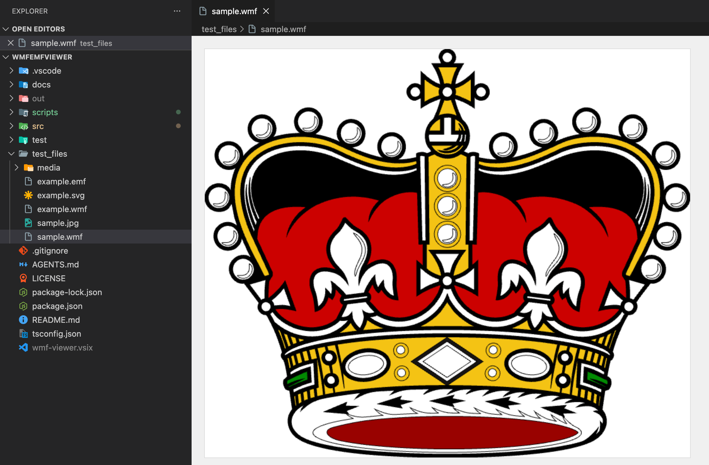
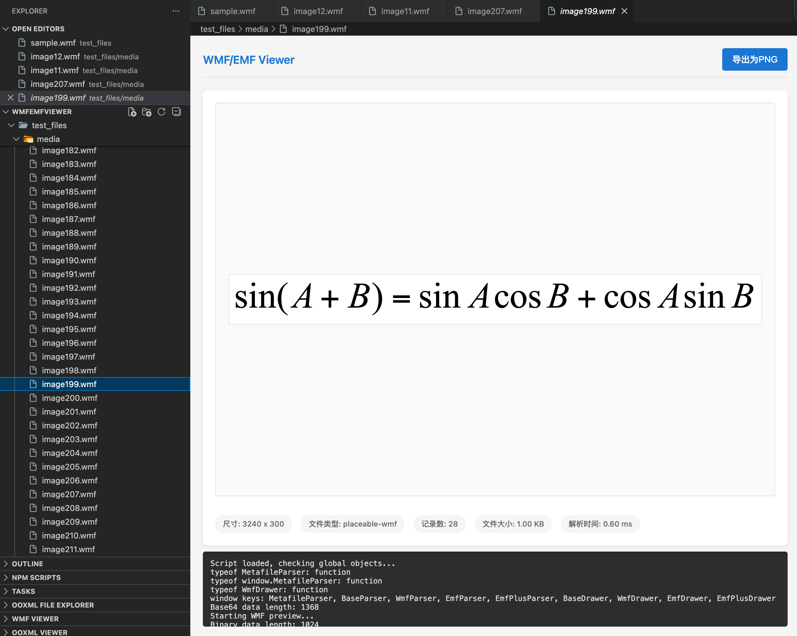

# WMF/EMF Viewer for Visual Studio Code

Preview **WMF** (Windows Metafile), **EMF** (Enhanced Metafile) and **EMF+** images directly in VS Code — no external tools needed.



## Features

- ✅ **Built-in preview** — Open `.wmf` / `.emf` files directly in the editor
- 🎨 **High-quality Canvas 2D rendering** — Accurate drawing of vector graphics, text and GDI objects
- 🔍 **Automatic format detection** — Distinguishes WMF, Placeable WMF, EMF and EMF+
- 🖱️ **Context menu integration** — Right-click any `.wmf` / `.emf` file and preview instantly
- 📦 **Zero dependencies** — Fully self-contained, works offline
- 🚀 **Fast** — In-process parsing and rendering, no server or native binaries

## Supported Formats

| Format            | Description                                |
| ----------------- | ------------------------------------------ |
| **WMF**           | Classic 16-bit Windows Metafile            |
| **Placeable WMF** | WMF with positioning header                |
| **EMF**           | Enhanced Metafile (32-bit records)         |
| **EMF+**          | Enhanced Metafile Plus (advanced graphics) |

## Installation

### From the Marketplace

1. Open VS Code
2. Go to the **Extensions** view (`Ctrl+Shift+X` / `Cmd+Shift+X`)
3. Search for **"WMF/EMF Viewer"**
4. Click **Install**

### From a VSIX file

```bash
# Build the VSIX yourself
npm install
npm run package
```

Then open VS Code → Extensions view → `...` menu → **Install from VSIX...** → select the generated `.vsix` file.

## Usage

### Editor mode (recommended)

Simply click a `.wmf` or `.emf` file in the Explorer. It opens in the WMF/EMF Viewer editor automatically.

### Preview mode

Right-click a `.wmf` or `.emf` file and choose **"Preview WMF/EMF Image"** to open it in a preview tab.



## Requirements

- Visual Studio Code `^1.75.0`

## Extension Settings

This extension contributes no settings — it just works.

## Release Notes

### 0.0.1

- Initial release: WMF / Placeable WMF / EMF / EMF+ preview support
- Explorer context menu integration
- Custom editor for `.wmf` and `.emf` files

## Known Issues

- Rendering of some rarely-used EMF records may be incomplete.
- Please report issues on the [GitHub repository](https://github.com/vscode-extensions/wmf-viewer).

## License

[MIT](LICENSE)

## Acknowledgments

- Parsing and rendering based on the official Microsoft specifications:
  - [MS-WMF] Windows Metafile Format
  - [MS-EMF] Enhanced Metafile Format
  - [MS-EMFPLUS] Enhanced Metafile Plus Format
