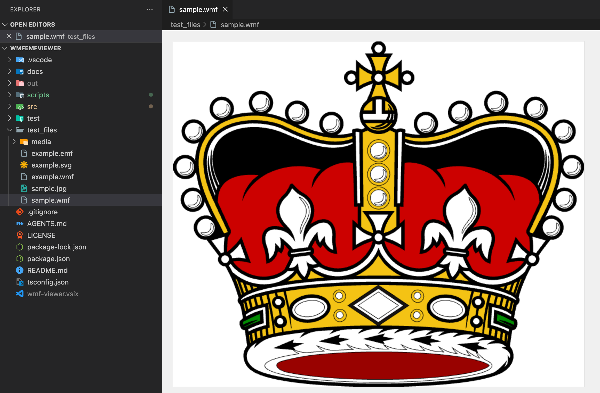
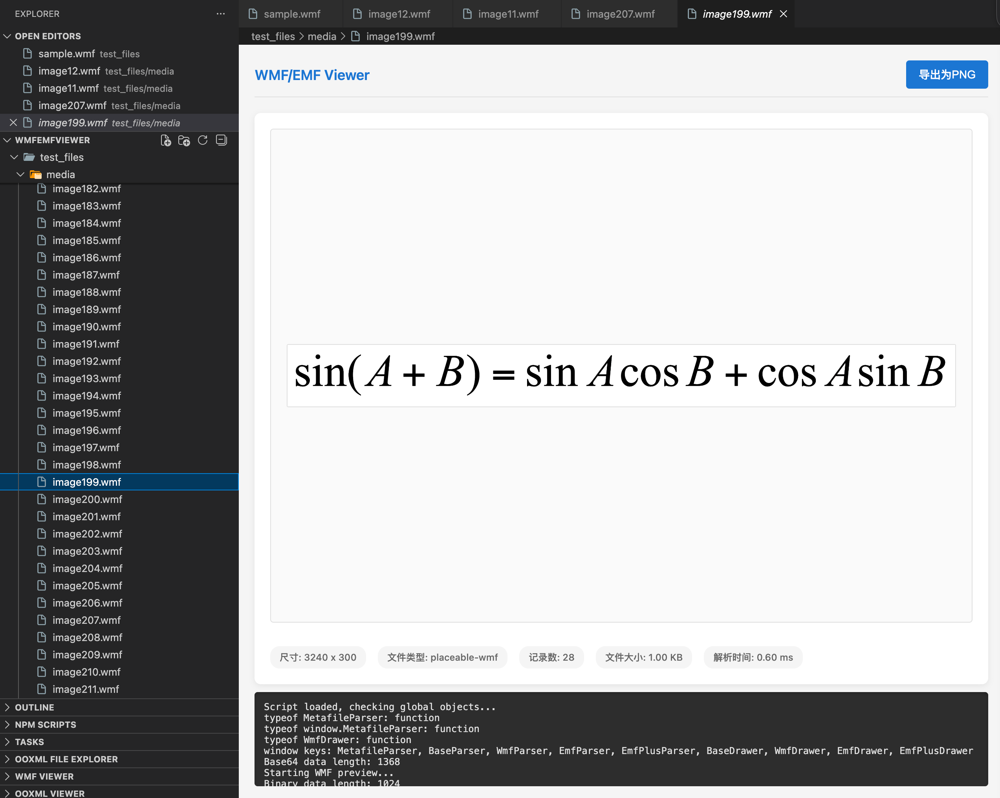

# WMF/EMF Viewer for VSCode

A Visual Studio Code extension that allows you to preview WMF (Windows Metafile Format) and EMF (Enhanced Metafile Format) images directly in the editor.




## Features

- 📁 Preview WMF, EMF, and EMF+ files directly in VSCode
- 🖼️ Supports both view and editor modes
- 🎨 High-quality Canvas 2D rendering
- 📋 Context menu integration for quick access
- 🔍 Automatic file type detection
- 🎯 Comprehensive format support (WMF, EMF, EMF+)

## Supported Formats

- **WMF** (Windows Metafile) - Classic vector graphics format
- **EMF** (Enhanced Metafile) - Enhanced version with better features
- **EMF+** (Enhanced Metafile Plus) - Modern format with advanced graphics

## Installation

### Method 1: From VSCode Marketplace

1. Open VSCode
2. Go to Extensions view (`Ctrl+Shift+X` / `Cmd+Shift+X`)
3. Search for "WMF/EMF Viewer"
4. Click "Install"

### Method 2: From VSIX File

1. Download the `.vsix` file from releases
2. Open VSCode
3. Go to Extensions view (`Ctrl+Shift+X` / `Cmd+Shift+X`)
4. Click on the three dots (`...`) in the top right corner
5. Select "Install from VSIX..."
6. Navigate to the downloaded `.vsix` file and select it

### Method 3: From Source

```bash
# Clone the repository
git clone https://github.com/vscode-extensions/wmf-viewer.git
cd wmf-viewer

# Install dependencies
npm install

# Build the extension
npm run build

# Press F5 in VSCode to run in debug mode
```

## Usage

### Preview Mode

1. Right-click on a `.wmf` or `.emf` file in the Explorer
2. Select "Preview WMF/EMF Image"
3. The image will open in a new preview tab

### Editor Mode

1. Simply click on a `.wmf` or `.emf` file
2. The file will automatically open in the WMF/EMF Viewer editor

## Project Structure

```
WmfEmfViewer/
├── .vscode/              # VSCode workspace configuration
├── docs/                 # Documentation and format specifications
├── scripts/              # Development and analysis scripts
├── src/                  # Source code
│   ├── build/           # Build scripts
│   ├── commands/        # VSCode command implementations
│   ├── modules/         # Core parsing and rendering
│   │   ├── drawers/    # Format-specific renderers
│   │   └── parsers/    # Format-specific parsers
│   ├── providers/       # VSCode provider implementations
│   ├── resources/       # Static resources (HTML templates)
│   ├── utils/           # Utility modules
│   └── extension.ts     # Main extension entry point
├── test/                 # Test files and examples
├── test_files/          # Sample WMF/EMF files for testing
├── out/                 # Compiled output (gitignored)
├── package.json         # Package configuration
├── tsconfig.json        # TypeScript configuration
└── README.md            # This file
```

## Development

### Prerequisites

- Node.js (v16+)
- npm (v7+)
- Visual Studio Code (v1.75.0+)

### Available Commands

```bash
# Install dependencies
npm install

# Build the extension (bundle + compile)
npm run build

# Build browser bundle only
npm run build:bundle

# Compile TypeScript to JavaScript
npm run compile

# Watch for changes and compile automatically
npm run watch

# Lint TypeScript files
npm run lint

# Run tests
npm run test

# Package the extension into a VSIX file
npm run package
```

### Development Workflow

1. **Setup**: `npm install`
2. **Development**: `npm run watch` (in terminal) + Press `F5` (to debug)
3. **Testing**: Open any `.wmf` or `.emf` file in the Extension Development Host
4. **Building**: `npm run build`
5. **Packaging**: `npm run package`

### Project Architecture

The extension follows a modular architecture:

- **Providers**: Handle VSCode integration (custom editor, commands)
- **Parsers**: Parse binary WMF/EMF/EMF+ file formats
- **Drawers**: Render parsed data to Canvas 2D
- **Utils**: Helper functions (coordinate transformation, GDI object management)
- **Build**: Scripts to bundle modules for browser compatibility

## Technical Details

### Parsing Strategy

The extension uses a multi-format parsing strategy:

1. **File Type Detection**: Automatically detects WMF, EMF, or EMF+ format
2. **Format-Specific Parsing**: Uses specialized parsers for each format
3. **Record Processing**: Parses metafile records sequentially
4. **Coordinate Transformation**: Applies appropriate transformations for Canvas rendering

### Rendering Pipeline

1. Parse binary metafile data
2. Extract drawing commands and GDI objects
3. Transform coordinates to Canvas coordinate system
4. Render using Canvas 2D API in webview

## Documentation

- **AGENTS.md**: Comprehensive guide for AI coding agents
- **docs/PROJECT_STRUCTURE.md**: Detailed project structure documentation
- **docs/[MS-WMF].pdf**: WMF format specification
- **docs/[MS-EMF].pdf**: EMF format specification
- **docs/[MS-EMFPLUS].pdf**: EMF+ format specification

## Testing

Sample WMF/EMF files are available in `test_files/` directory for testing various format features.

## License

This project is licensed under the MIT License. See the [LICENSE](LICENSE) file for details.

## Contributing

Contributions are welcome! Please feel free to submit a Pull Request.

### Contribution Guidelines

1. Fork the repository
2. Create a feature branch
3. Make your changes
4. Run `npm run lint` and fix any issues
5. Test your changes with sample files
6. Submit a Pull Request

## Acknowledgments

- Based on Microsoft's WMF, EMF, and EMF+ format specifications
- Built with TypeScript and VSCode extension API
- Uses Canvas 2D API for high-quality rendering

## Support

For issues, questions, or feature requests, please visit the [GitHub repository](https://github.com/vscode-extensions/wmf-viewer).
